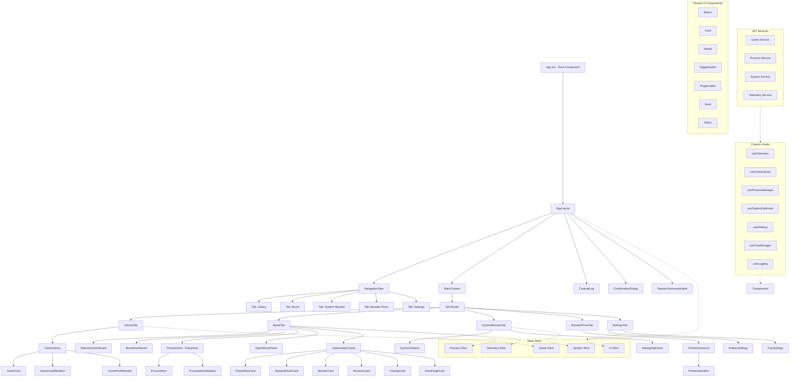

# Component Hierarchy Diagram

## Visual Representation of Component Relationships



## Component Categories

### 1. **Layout Components** (`components/layout/`)
- **AppLayout**: Main application layout wrapper
- **NavigationTabs**: Tab navigation bar
- **Header**: Application header (optional)
- **Footer**: Application footer (optional)

### 2. **UI Components** (`components/ui/`)
- **Button**: Reusable button with variants
- **Card**: Card container for content
- **Modal**: Dialog/modal component
- **ToggleSwitch**: Toggle switch component
- **ProgressBar**: Progress indicator
- **Input**: Form input field
- **Select**: Dropdown select component

### 3. **Feature Components** (`components/features/`)
#### Library Feature (`components/features/library/`)
- **GameLibrary**: Main library container
- **GameCard**: Individual game card
- **GameCardSkeleton**: Loading skeleton for game cards
- **GameProfileModal**: Game configuration modal

#### Boost Feature (`components/features/boost/`)
- **BoostDashboard**: Main boost dashboard
- **TelemetryDashboard**: Live system metrics display
- **ProcessGrid**: Virtualized process list
- **ProcessItem**: Individual process item
- **ProcessItemSkeleton**: Loading skeleton for processes
- **HyperBoostPanel**: HyperBoost mode selector
- **OptimizationCards**: Grid of optimization cards

#### System Booster Feature (`components/features/system-booster/`)
- **SystemCleaner**: System cleaning component
- **StartupOptimizer**: Startup optimization component

#### Booster Prime Feature (`components/features/booster-prime/`)
- **PrimeGamesList**: List of supported games
- **PrimeGameItem**: Individual prime game item

#### Settings Feature (`components/features/settings/`)
- **HotkeySettings**: Hotkey configuration
- **TraySettings**: Tray mode settings
- **ProfileSettings**: User profile settings

### 4. **Shared Components** (`components/shared/`)
- **ConsoleLog**: System console output
- **ConfirmationDialog**: Confirmation modal
- **SessionSummaryModal**: Session results modal

## Component Props Interface Design

```typescript
// Example: GameCard component props
interface GameCardProps {
  game: Game;
  onLaunch: (game: Game) => void;
  onConfigure: (game: Game) => void;
  isLoading?: boolean;
  className?: string;
}

// Example: ProcessGrid component props
interface ProcessGridProps {
  processes: ProcessInfo[];
  selectedPids: number[];
  onToggleProcess: (pid: number) => void;
  isLoading?: boolean;
  windowWidth?: number;
}

// Example: TelemetryDashboard component props
interface TelemetryDashboardProps {
  telemetry: TelemetryData;
  isPolling?: boolean;
  onRefresh?: () => void;
  className?: string;
}
```

## Component Composition Pattern

```typescript
// Parent component example
const BoostTab = () => {
  const { telemetry, isPolling } = useTelemetry();
  const { processes, selectedPids, toggleProcess } = useProcessManager();
  
  return (
    <div className="boost-tab">
      <TelemetryDashboard 
        telemetry={telemetry} 
        isPolling={isPolling} 
      />
      <BoostDashboard />
      <ProcessGrid
        processes={processes}
        selectedPids={selectedPids}
        onToggleProcess={toggleProcess}
      />
      <HyperBoostPanel />
      <OptimizationCards />
    </div>
  );
};
```

## Performance Considerations

1. **Virtualization**: ProcessGrid uses react-window for virtualization
2. **Memoization**: Expensive components use React.memo
3. **State Colocation**: State moved to nearest common ancestor
4. **Code Splitting**: Feature-based code splitting with React.lazy
5. **Tree Shaking**: Named exports only for optimal bundling

## Testing Strategy

```typescript
// Component testing structure
describe('GameCard', () => {
  it('renders game title and icon', () => {});
  it('calls onLaunch when play button clicked', () => {});
  it('calls onConfigure when configure button clicked', () => {});
  it('shows skeleton when loading', () => {});
});

// Hook testing structure
describe('useGameLibrary', () => {
  it('fetches games on mount', () => {});
  it('handles scan errors gracefully', () => {});
  it('updates game profile correctly', () => {});
});
```

This hierarchy ensures clear separation of concerns, optimal reusability, and maintainable code structure.
